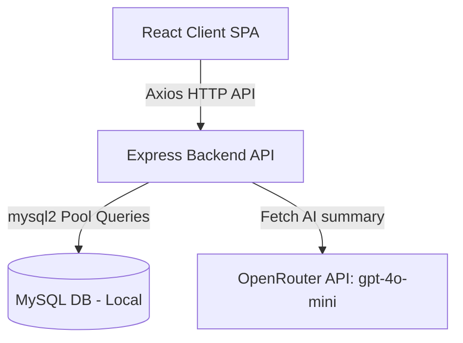

# Therapy Appointment Summary Application - Project Report

This report outlines the complete architecture, features, design specifications, and database schema built for the **Therapy Appointment Summary Application** up to the current state.

---

## 🎨 1. Design & Visual Identity (Wellness Redesign)

The application has been customized with an elegant, organic wellness theme, discarding high-contrast tech highlights in favor of a soothing clinical experience.

*   **Color Palette**:
    *   **Background**: Soothing Warm Linen Cream (`#f7f4ed`)
    *   **Card Framework**: Solid Pure White (`#ffffff`) with subtle warm-gray borders and diffused, high-radius shadows.
    *   **Accents & Typography**: Deep Forest Green (`#2c3e2e`) for main headings, buttons, and visual focus elements.
    *   **Badges**: Sage Green (`#e2ece9` background, `#2c3e2e` text) for clinical categories.
*   **Typography**:
    *   Headings render in **Google Font 'Lora'** (a refined, professional serif).
    *   Paragraphs and metrics render in **'Inter'** (a clean, highly readable sans-serif).
*   **Interactive Background**:
    *   An elegant, slow-drifting **Three.js Sage Particle Constellation** (`ThreeBackground.jsx`) that simulates floating particles connected by thin, fading lines.

---

## 🏗️ 2. Project Architecture

The application is structured into a React frontend client and an Express-based Node.js backend connected to a MySQL database.



### File Hierarchy
```
InternProject/
├── server/                     # Backend Source Code
│   ├── config/db.js            # MySQL Connection Pool and Auto-Init
│   ├── controllers/            # Controller layer (Therapists, Appointments, Insights)
│   ├── middleware/             # Error handlers & validation
│   ├── routes/                 # Express route definitions
│   ├── services/aiService.js   # OpenRouter Integration Service
│   ├── .env                    # Environment settings (Port, DB, OpenRouter Key)
│   ├── server.js               # Application Entry Point
│   ├── seed-db.js              # Mock data database seeder
│   └── test-endpoints.js       # Express verification script (14 test cases)
├── src/                        # Frontend React Source Code
│   ├── components/             # Reusable Visual Elements (Cards, Nav, Background)
│   ├── pages/                  # Page Modules (Directory & Details view)
│   ├── services/api.js         # API integration abstractions
│   ├── App.jsx                 # Client-side router and root component
│   └── index.css               # Wellness styling variables and rules
```

---

## 💾 3. Database Schema

The database setup is **completely automated** on backend startup. It verifies and initializes the database `therapy_summary_db` and configures the following relational tables:

```sql
-- Therapist records and metadata
CREATE TABLE IF NOT EXISTS therapists (
  therapist_id INT AUTO_INCREMENT PRIMARY KEY,
  therapist_name VARCHAR(100) NOT NULL,
  specialization VARCHAR(100),
  description TEXT,
  profile_image VARCHAR(255)
);

-- Appointments logged under therapists
CREATE TABLE IF NOT EXISTS appointments (
  appointment_id INT AUTO_INCREMENT PRIMARY KEY,
  therapist_id INT NOT NULL,
  appointment_title VARCHAR(255) NOT NULL,
  summary TEXT NOT NULL,
  FOREIGN KEY (therapist_id) 
    REFERENCES therapists(therapist_id) 
    ON DELETE CASCADE
);
```

---

## ⚙️ 4. Backend REST APIs

The backend handles requests, routes them to database controllers, queries the MySQL database, communicates with the OpenRouter AI model, and manages errors uniformly.

### REST Endpoint Catalog

| Endpoint | Method | Description | Input Body / Params |
| :--- | :---: | :--- | :--- |
| `/api/therapists` | `GET` | Fetch all therapists | *None* |
| `/api/therapists/:id` | `GET` | Fetch a single therapist's info | `id` (Param) |
| `/api/therapists` | `POST` | Add a new therapist profile | `{"therapist_name", "specialization", "description", "profile_image"}` |
| `/api/therapists/:id` | `PUT` | Update a therapist's profile | `id` (Param), updated fields in body |
| `/api/therapists/:id` | `DELETE`| Delete a therapist & their appointments | `id` (Param) |
| `/api/appointments/therapist/:therapistId` | `GET` | Get all appointments for a therapist | `therapistId` (Param) |
| `/api/appointments/:id` | `GET` | Fetch details of a single appointment | `id` (Param) |
| `/api/appointments` | `POST` | Log a new therapist appointment | `{"therapist_id", "appointment_title", "summary"}` |
| `/api/appointments/:id` | `PUT` | Update appointment details | `id` (Param), `{"appointment_title", "summary"}` |
| `/api/appointments/:id` | `DELETE`| Remove a single appointment | `id` (Param) |
| `/api/insights` | `GET` | Retrieve real-time center insights | *None* |
| `/api/generate-summary/:therapistId` | `POST` | Generate clinical consolidated AI summary | `therapistId` (Param) |

### 🤖 AI Summary Service
The server uses **OpenRouter API** with the **`openai/gpt-4o-mini`** model to consolidate clinical summaries:
1. Pulls all appointment summaries logged under the target `therapistId`.
2. Packages them into a structured prompt instructing the model to synthesize observations, progress, recurring clinical themes, and patient outcomes.
3. Returns a clean, professional clinical synthesis block to the UI.

---

## 💻 5. Frontend Interfaces

The React application implements two core views:

### Page 1: Therapist Directory (`/`)
*   **Directory Grid**: Displays customized therapist profile cards showing names, specialties, and bios.
*   **Live Search**: Filters therapist cards instantly based on search queries.
*   **Creation Panel**: A modal window to dynamically register new therapist profiles.
*   **Global Metrics Dashboard**: Renders the system insights returned by the backend (`/api/insights`) to display aggregate metrics.

### Page 2: Therapist Details & Timelines (`/therapist/:id`)
*   **Header Profile**: Showcases the therapist's bio, specialization, and profile image.
*   **Appointment Timeline**: Renders a chronological feed of logged appointments.
*   **Appointment Actions**: Allows logging new appointments, editing existing summaries, or removing records.
*   **Consolidated AI Summaries**: Uses a custom **`SummaryCard`** with clinical-report styling to trigger and display the consolidated AI summarization generated by the OpenRouter service.

---

## 🧪 6. Testing & Validation

The backend includes a dedicated test suite (`server/test-endpoints.js`) covering 14 validation cases:
1. Creating, reading, updating, and deleting therapists.
2. Handling invalid therapist parameters.
3. Creating, reading, updating, and deleting appointments.
4. Handling cascading deletions (deleting a therapist deletes their appointments).
5. Calculating real-time insights metrics.
6. Triggering and receiving AI summary generations.

To execute the test suite, run:
```bash
cd server
node test-endpoints.js
```

---

## 🚀 7. Running the Project Locally

### 1. Configure the Environment
Ensure your local MySQL server is running. Create/update the file [server/.env](file:///c:/Users/Dhanush%20Ragava%20R%20V/OneDrive/Desktop/InternProject/server/.env):
```env
PORT=5000
DB_HOST=localhost
DB_USER=root
DB_PASSWORD=YOUR_MYSQL_PASSWORD
DB_NAME=therapy_summary_db
OPENROUTER_API_KEY=YOUR_OPENROUTER_KEY
```

### 2. Start the Backend
```bash
cd server
npm install
npm run dev
```

### 3. Start the Frontend
```bash
npm install
npm run dev
```
Open your browser at `http://localhost:5173`.
